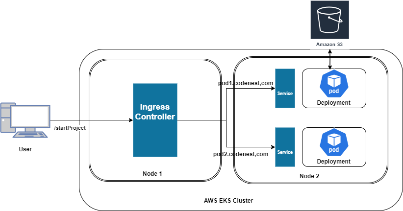
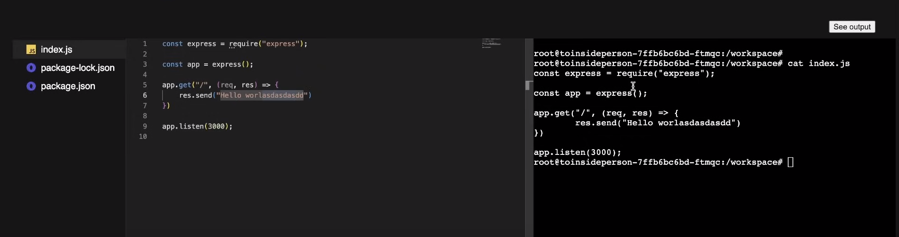

# CodeNest

CodeNest is an Online Code Editor for Backend/Frontend Apps.

# Tech Stack
- Node.js
- Express
- Docker
- WebSockets (Socket.io)
- AWS EKS (Kubernetes)
- AWS S3 Bucket
- Psuedo Terminals

# How I think of this Architecture ?
- First Principles (~5 years of Coding)
- Reverse Engineering (Code Sandbox ~ 3 hours)
- Referred Blog Posts, Github and Videos on YT

# User Stories
- As a user, I should be able to start a fresh new environment in my selected tech stack so that I can work on my project
- As a user, I should be able to have all the boiler plate code ready to be worked upon
- As a user, I should be able to edit and save my progress of the code.
- As a user, I should be able to run the code I have written either through terminal or run button just like as an IDE.


# Challenges
- Remote Code Execution (Browser can't run the Rust/C++ etc code. Not technically true but that won't be a good approach as it would mean loading all the boilerplate code in the browser which could degrade the experience of the user)

- Long Running Processes (Realtime view of the IDE constantly running and power of vcpus)

- Shell access inside browser
- File Storage

# Architecture Workflow
1. Start a K8s Cluster, and set some autoscaling policies on the nodes.
2. Attach an Ingress Controller(I am using Nginx) to the Node. (Run the ingress-controller.yaml file using kubectl)
3. Point your DNS to the IP of the ingress controller. DNS will be mapped in way *.codenest.com as for each pod we get new url and they should all go the ingress controller ip at first.
4. As user start the projects, start a pod (deployment in k8s), a service and ingress for them.
5. As user leave the projects, stop the respective deployment, service and ingress for them.
6. Cluster will autoscale based on the policies I added.


# Why this approach is secure ?
1. Remote Code runs in a Pod.
2. Pod has restricted permissions.
3. Pod has resource limits (only 2cpus for example).
4. Pod has its own network (no port conflict).

# Why is this scalable ?
1. Starting a new runner is as simple as starting a new Pod.
2. As the CPU Usage goes up more pods get added.
3. All I need to do increase the number of nodes in the cluster.

# Scope of upgrade
1. User can inspect the ws codebase which is not good as they can see the aws credentials.
2. User can still reboot the machine.
3. Network Volumes can be used for persistent storage.

## Installation

### Install Frontend Dependencies

Open Terminals for frontend, init-service and orchestrator-simple service directory

```bash
cd frontend
npm i
```
```bash
cd init-service
npm i
```
```bash
cd orchestrator-simple
npm i
```


Install Ingress Controller for your K8s Cluster

```bash
cd k8s
kubectl apply -f ingress-controller.yaml
```

## Usage

### Start all the above services

```bash
npm run dev
```

## Output







## Contributing

Pull requests are welcome. For major changes, please open an issue first
to discuss what you would like to change.

Please make sure to add comments as appropriate.

## License

[MIT](https://choosealicense.com/licenses/mit/)